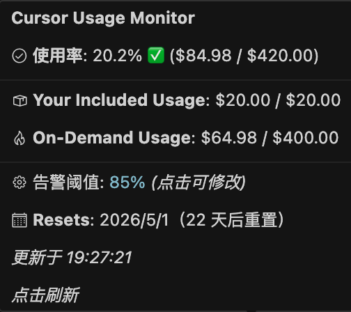

# Cursor Usage Monitor

在 Cursor IDE 中实时展示你的 Cursor 用量信息，包括 **Included Usage**（套餐内用量）、**On-Demand Usage**（按需用量）以及总用量。

## 使用示例



鼠标悬停在状态栏上即可查看：
- 使用率百分比（超过阈值变橙色警告）
- Your Included Usage 和 On-Demand Usage（含限额）
- 告警阈值（点击可修改）
- 账单重置日期和倒计时

## 功能

- **状态栏** — 底部状态栏实时显示总用量金额
- **使用率告警** — 可配置阈值（默认 85%），超过时状态栏变橙色
- **悬停浮窗** — 展示 Included / On-Demand 用量详情、使用率、重置日期
- **侧边栏面板** — 独立的用量概览视图
- **自动刷新** — 可配置的自动刷新间隔（默认 5 分钟），点击状态栏手动刷新
- **Token 引导** — 首次启动自动提示输入 Token

## 安装

从 [Releases](https://github.com/pittttt/cursor-usage-monitor/releases) 下载最新的 `.vsix` 文件，然后：

```bash
cursor --install-extension cursor-usage-monitor-0.2.0.vsix
```

或在 Cursor 中按 `Cmd+Shift+P` → `Extensions: Install from VSIX...` 选择文件安装。

## 配置 Token

1. 在浏览器中登录 [cursor.com](https://cursor.com)
2. 打开开发者工具（F12）→ Application → Cookies
3. 找到 `WorkosCursorSessionToken` 的值并复制
4. 在 Cursor 中按 `Cmd+Shift+P`，运行 **Cursor Usage: 设置 Token**
5. 粘贴 Token

Token 会安全地存储在 VS Code SecretStorage 中。

## 设置

| 设置项 | 默认值 | 说明 |
|--------|--------|------|
| `cursorUsageMonitor.refreshInterval` | `5` | 自动刷新间隔（分钟） |
| `cursorUsageMonitor.warningThreshold` | `85` | 用量告警阈值（百分比） |

## 使用的 API

- `GET https://cursor.com/api/usage-summary` — 获取 Included / On-Demand 用量
- `GET https://cursor.com/api/usage?user=ID` — 获取 Premium 请求数
- `POST https://cursor.com/api/dashboard/get-monthly-invoice` — 获取月度账单明细
- `POST https://cursor.com/api/dashboard/get-hard-limit` — 获取 On-Demand 消费上限

所有 API 通过 `WorkosCursorSessionToken` Cookie 进行认证。
